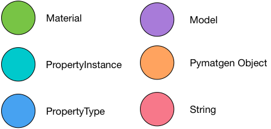
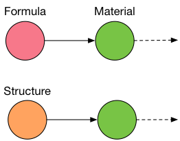
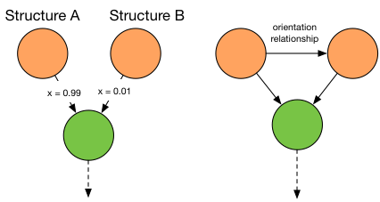
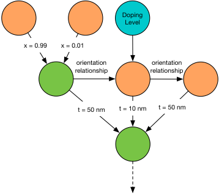
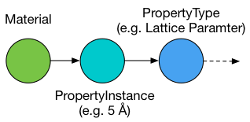
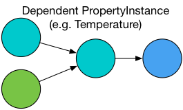
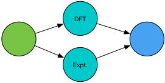
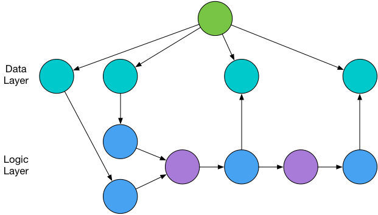

**This is not ready for public use yet, please wait for a formal release announcement/publication! Thank you.**

# Propnet Design Overview

Propnet is designed to synthesize all current materials science knowledge into a graph, that can be traversed to calculate additional properties when provided with some initial information.

## The Graph

As much as possible, information is encoded into the graph itself, rather than creating additional data structures. Rather than re-invent the wheel, we are using the popular and well-tested [networkx 2.0](https://networkx.github.io) graph library to provide the necessary data structures and graph algorithms that form the foundation of Propnet.

## Property

A 'property' refers to a property of a material, such as its lattice parameter, band gap or bulk modulus.

In Propnet, properties are rigorously defined to ensure consistent interpretations between different models, and this crucially includes explicit units and uncertainties. Where uncertainties are unknown, we apply rule-of-thumb uncertainties derived from statistical analysis of similar data to give a first-approximation of our confidence in a property.

In terms of implementation, a `Property` provides information on the property itself (e.g. lattice parameter has units of length), and a `PropertyInstance` is an object that combines a `Property` with a value (e.g. 5Å), a reference for where the property came from, and edges to the materials it is associated with.

## Material

There is a necessary distinction between a real 'material' vs. an ideal, perfect crystal. In the [Materials Project](http://materialsproject.org/)  a 'material' typically refers to the latter. However, properties can come from many sources, including experiment data where additional phases or impurities might be present.

Propnet attempts to gracefully handled this distinction. A `PropertyInstance` can have edges to the material it's associated with. In the simplest case, this could be an edge to a material defined simply by its chemical formula. If the structure is known, it is represented by a [pymatgen](https://github.com/materialsproject/pymatgen) `Structure` object.

To illustrate, a `PropertyInstance` of a lattice parameter calculated using DFT, would have an edge to a `PropertyInstance` representing a temperature of 0 K, and an edge to the `Structure` associated with it. In this case, the edge weight to the `Structure` would be 1.0, since this is an ideal, perfect material.

However, if the `PropertyInstance` came from experimental data and a second impurity phase is present, it would have edges to *two* `Structure` objects, with the edge for the majority phase given a weight of, e.g., 0.99 (if it was 99% pure), and the second edge with a weight of 0.01 for the impurity phase.

In the case of a property where there is a *relationship* between `Structure` objects, such as a lattice misfit, then an edge is added between the two `Structure` objects specifying this relationship, i.e. the orientation relationship.

## Models

A model specifies:

* A list of all Properties it uses
* A list of Properties it can output
* A master equation, specified symbolically using [SymPy](http://www.sympy.org)
* A mapping of symbols in the master equation to their canonical Property names
* A list of `Conditions` for each symbol
* A list of `Assumptions` associated with the model output

Initially, we are supporting analytical models only. However, as the project progresses we expect to support the following machine learning models:

* Neural networks (feedforward, convolutional, recurrent) via Caffe or Keras
* Scikit-learn models (tree ensembles, support vector machines, generalized linear models, feature engineering, pipeline models)

Models must be serialized to an appropriate format and provide a consistent interface. Initially, we will figure this out on a case-by-case basis, and likely include a plug-in interface for external projects.

## Conditions and Assumptions

The specific implementation here will likely change.

An `Assumption` is associated with a property and can be something like:

* An `IsotropicAssumption`, assumes a material is isotropic
* A `Temperature(300)` assumption, assumes an experimental measurement was taken at room temperature

A `Condition` is a model requirement and can be something like:

* A model could expect a lattice parameter `PropertyInstance` with the condition that the `PropertyInstance` has an edge to ` Temperature(0K)` condition, i.e. the lattice parameter is measured at 0 K.

If a model has inputs where it is unknown if they satisfy its conditions (e.g. a lattice parameter property exists in the graph, but the temperature it was measured at is not specified), then it becomes an `Assumption` in the model output.

## Propagation of references and assumptions

Any reference or `Assumption` associated with a `PropertyInstance` is propagated through the model and through the graph, so that when the graph is queried for the specific value of a property, the assumptions and a list of references are also supplied, in addition to the value of the property itself.

## Node types and edges

Our graph has the following types of *node* corresponding to the concepts above:



*Edges* between these nodes describe the relationships between them. To illustrate these relationships, consider our definition of a material:



This shows the simplest definition of a material, either known by its chemical formula, or by its crystallographic structure.



We can also represent compound materials. On the left, the edge attribute *x* gives the proportion of each structure that makes up the material. On the right, we use an edge attribute to define an orientation relationship between structures.



In principle, we can construct materials of arbitrary complexity: here we represent a multi-layer material with film thicknessness specified by the edge attribute *t*, with one component of the multi-layer being doped.

At this stage, none of the materials in Propnet will be this complex. This example is simply included as an illustration that the design should be forward-looking and transferrable.



Once a material has been specified, we can define a property of that material, such as its lattice parameter. Above, the `PropertyInstance` node contains the value of that property, and it points to the graph's canonical `PropertyType` node that the value describes.



A `PropertyInstance` with an edge to another `PropertyInstance` describes a dependent property: in this case, it could be the temperature at which that measurement was taken. For the first version of Propnet, all measurements are derived from 0 K DFT simulations.



It is also possible to define multiple `PropertyInstances` for the same material, for example an experimental and DFT value. When evaluating the graph, the user can choose a strategy which will select the most appropriate `PropertyInstance`: for example, the user might select to always prefer DFT data, or to always prefer the `PropertyInstance` with the smallest uncertainty.


The simplest `Model` relates one `PropertyType` to another `PropertyType`, as shown above.



Incorporating all these node types into the full graph, we can see a clear separation between data (`Materials` and their associated `PropertyInstances`), and logic (`Models` and their associated `PropertyTypes`, which form the input and output of `Models`).

To 'solve' the graph, we look for `PropertyType` nodes that do not have any associated `PropertyInstances`, and then from the graph topology see if there is a route to calculate this property. If a route exists, the property is calculated, and a new `PropertyInstance` inserted into the graph.


# Guidelines for Contributions

Properties and models each have their own distinct file, to make it easier to version models and properly credit the people who made them. When necessary, we will use the git short hash to refer to a specific version of a model, though in most cases models should be fixed once created.

## Submitting a Property

Please copy an existing property and submit a pull request, its filename should match the canonical name of the property. Properties are defined in [YAML](http://yaml.org) syntax.

Key fields are as follows:

* `name`: A unique, canonical name for the property, lowercase, must be a valid Python identifier (no spaces)
* `unit`: A list of of lists, from [pint's serialization format](http://pint.readthedocs.io/en/latest/serialization.html), with an implicit value of 1.0 (see example below)
* `display_names`: List of human-readable name(s), LaTeX syntax allowed, first name will be the preferred name
* `display_symbols`: As above, but for symbols
* `dimension`: The expected dimension (using the same definition as [numpy ndarray shape](https://docs.scipy.org/doc/numpy-1.13.0/reference/generated/numpy.ndarray.shape.html)) of the property. If there are multiple ways to define the property (e.g. vector, scalar), define multiple properties with a simple model to convert between them.
* `test_value`: A physically-plausible test value in the units specified above, will be used to populate the graph with test data.
* `comment`: Optional string with additional information.

The easiest way to get a valid unit is simply:

```
from pint import UnitRegistry
ureg = UnitRegistry()
# replace "..." with your units here
my_units = ureg.parse_expression("...")
# check units look correct
print(my_units)
# and convert to tuple, assuming value of 1.0
my_units = my_units.to_tuple()[1]
```

## Submitting a Model

Please copy an existing model and submit a pull request, its filename should match the canonical name of the model. Any additional code/resources necessary for the model to work should go in the folder `../supplementary/model_name/`.

## Submitting a code contribution

We only have a few guidelines at present:

* Please be [PEP8](https://www.python.org/dev/peps/pep-0008/) compliant (not strict about line length, but try to keep docstrings to 72 characters, code to 100)
* We're targeting Python 3.6+ only
* [Type hints](https://www.python.org/dev/peps/pep-0484/) are preferred
* If a function or method returns multiple values, return a `namedtuple`, this allows easier refactoring later and more readable code. Functions and methods should also always consistently return the same types (with the possible exception of `None`).
* If you spot a bad practice / anti-pattern in the code, you're honor bound to report it :-)

# Web Interface

Each model and property will have an auto-generated page associated with them. This page will allow manual input of model parameters and calculation of model outputs, and will also provide documentation/explanations of how the model works. On a technological level, this will make use of the [Dash library by plot.ly](https://plot.ly/products/dash/).

When contributing a model, to add additional documentation please place a Markdown file with the canonical model name in the `../models/docs/` directory.

# Glossary

**Material:** Can be a formula, crystallographic structure, or more complex material

**PropertyType:** (or "Property") A distinct physical *Quantity,* such as lattice parameter or temperature

**PropertyInstance:** Refers to a *Quantity* and its associated *PropertyType*, as well as any associated metadata such as references, that is typically associated with a *Material* (this may be renamed later)

**Quantity:** Refers to a *value* which can be a scalar/vector/matrix/tensor and its associated *unit*

**Model:** Something that relates one set of properties to another set of properties


# FAQ

All this is subject to change, since we're still at the design stage. Until documentation is written, please find some answers to common questions:

Q. How does this differ to tensor graph libraries such as PyTorch and Tensorflow?

A. These libraries are excellent tools for creating tensor graphs, but have different design goals and are only superficially similar. Whereas a single node in these tensor graph libraries is a mathematical operation, in our graph a node contains an entire mathematical model and associated metadata, including references. It also gracefully handles propagation of units and uncertainties. As such, Propnet is designed at a much higher-level than these other libraries: a single node in Propnet could itself be an entire Tensorflow neural network. Due to this design, Propnet will also have an order of magnitude fewer nodes than a typical Tensorflow graph, so allows for a simpler implementation.

Hat tip to @jdagdelen for the Propnet name.