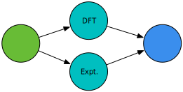
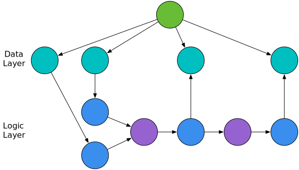

# Propnet

Propnet is a knowledge graph for materials science. Given a set of *properties* about a given material, it can try to derive additional properties of that material using *models*. It is intended to integrated closely with the [Materials Project](http://materialsproject.org) and its large database of materials properties.

[](https://travis-ci.org/materialsintelligence/propnet) [](https://propnet.herokuapp.com)

**This is not ready for public use yet, please wait for a formal release announcement/publication! Thank you.** Any questions should be directed to the project lead @computron or, in the case of code, to the individual project contributors.

# Table of Contents


* [Guidelines for Contributions](#guidelines-for-contributions)
  * [Submitting a Property](#submitting-a-property)
  * [Submitting a Model](#submitting-a-model)
  * [Submitting a code contribution](#submitting-a-code-contribution)
* [Web Interface](#web-interface)
* [Propnet Design Overview](#propnet-design-overview)
    * [Glossary](#glossary)
    * [The Graph](#the-graph)
    * [Property](#property)
    * [Material](#material)
    * [TODO: Constraints and Assumptions](#constraints-and-assumptions)
    * [Solving the Graph](#solving-the-graph)
* [FAQ](#faq)

# Guidelines for Contributions

Properties and models each have their own distinct file, to make it easier to version models and properly credit the people who made them. When necessary, we will use the git short hash to refer to a specific version of a model or property, though in most cases these should not change much once they are created.

## Submitting a Property

All properties can be found in `/properties/`.

Please copy an existing property and submit a pull request, its filename should match the canonical name of the property. Properties are defined in [YAML](http://yaml.org) syntax.

Key fields are as follows:

* `name`: A unique, canonical name for the property, lowercase, must be a valid Python identifier (no spaces)
* `unit`: A list of of lists, from [pint's serialization format](http://pint.readthedocs.io/en/latest/serialization.html), with an implicit value of 1.0 (see example below)
* `display_names`: List of human-readable name(s), LaTeX syntax allowed, first name will be the preferred name
* `display_symbols`: As above, but for symbols
* `dimension`: The expected dimension (using the same definition as [numpy ndarray shape](https://docs.scipy.org/doc/numpy-1.13.0/reference/generated/numpy.ndarray.shape.html)) of the property. If there are multiple ways to define the property (e.g. vector, scalar), define multiple properties with a simple model to convert between them.
* `test_value`: A physically-plausible test value in the units specified above, will be used to populate the graph with test data.
* `comment`: Optional string with additional information.

If you want to check your unit definitions, the easiest way is to try it interactively:

```
from pint import UnitRegistry
ureg = UnitRegistry()
# replace "..." with your units here
my_units = ureg.parse_expression("...")
# check units look correct
print(my_units)
# and convert to tuple, assuming value of 1.0
my_units = my_units.to_tuple()[1]
```

## Submitting a Model

All models can be found in `/models/`.

Please copy an existing model and submit a pull request, its filename should match the name of the model class.

Models should subclass `AbstractModel` (core.models.AbstractModel) and have the following methods:

* `title`, `tags`, `description` and `references` for documenting the model, `tags` is a list of strings of whatever seems like a sensible tag for the model (for example 'mechanical', 'thermo' or 'electronic'), 'stub' is a special tag for trivial models that simply convert one representation of a property to a different equivalent representation, for example due to different notations etc., `references` should be a list of strings in BibTeX format
* `symbol_mapping`: for convenience, your model should use short `symbols` to represent quantities, e.g. `E` for `youngs_modulus`, the symbol mapping gives the canonical property name for each symbol
* `connections` gives the valid inputs and outputs for the model
* `evaluate` takes a dictionary of symbols and their associated values for inputs, and a desired `output_symbol`, and will return the value for the output symbol if possible, or `None` if it cannot be solved for that output symbol

If your model is defined by a set of equations, Propnet can solve them for you using Sympy. In this case, you can subclass `AbstractAnalyticalModel` and include a list of `equations` (see an example for more information).

Initially, we are supporting analytical models only. However, as the project progresses we expect to support the following machine learning models:

* Neural networks (feedforward, convolutional, recurrent) via Caffe or Keras
* Scikit-learn models (tree ensembles, support vector machines, generalized linear models, feature engineering, pipeline models)

Models must be serialized to an appropriate format and provide a consistent interface. If additional code/resources necessary for the model to work should go in the folder `models/supplementary/model_name/`. Initially, we will figure this out on a case-by-case basis, and likely include a plug-in interface for external projects.

## Submitting a code contribution

We only have a few guidelines at present:

* Please be [PEP8](https://www.python.org/dev/peps/pep-0008/) compliant (not strict about line length, but try to keep docstrings to 72 characters, code to 100)
* We're targeting Python 3.6+ only
* [Type hints](https://www.python.org/dev/peps/pep-0484/) are preferred for core code
* If a function or method returns multiple values, return a `namedtuple`, this allows easier refactoring later and more readable code. Functions and methods should also always consistently return the same types (with the exception of `None`).
* If you spot a bad practice / anti-pattern in the code, you're honor bound to report it :-)

# Web Interface

Each model and property will have an auto-generated page associated with them. This page will allow manual input of model parameters and calculation of model outputs, and will also provide documentation/explanations of how the model works. The uses the [Dash library by plot.ly](https://plot.ly/products/dash/). To test it out, you can run the `app.py`, or can see the app deployed online at [https://propnet.herokuapp.com](https://propnet.herokuapp.com).

# Propnet Design Overview

Propnet is designed to synthesize all current materials science knowledge into a graph, that can be traversed to calculate additional properties when provided with some initial information.

## Glossary

**Material:** Can be a formula, crystallographic structure, or more complex material

**PropertyType:** A distinct physical *Quantity,* such as lattice parameter or temperature

**Property:** A class containing a *Quantity* and its associated *PropertyType*, as well as any associated metadata such as references, that is typically associated with a *Material* (this may be renamed later)

**Quantity:** Refers to a *value* which can be a scalar/vector/matrix/tensor and its associated *unit*

**Model:** Something that relates one set of properties to another set of properties, an **AnalyticalModel** refers to a model governed by a set of equations that we try to solve internally using Propnet, otherwise a model can use external Python code, a ML model, etc. to calculate a given property

**Node:** All properties, materials, models are nodes in our graph.

**Edge:** An edge refers to a relationship between a given property, material or model and another property, material or model. An edge can have a direction and additional associated information.

## The Graph

As much as possible, information is encoded into the graph itself, rather than creating additional data structures. Rather than re-invent the wheel, we are using the popular and well-tested [networkx](https://networkx.github.io) graph library to provide the necessary data structures and graph algorithms that form the foundation of Propnet.

Our graph has the following types of node:


## Property

A 'property' refers to a property of a material, such as its lattice parameter, band gap or bulk modulus.

In Propnet, properties are rigorously defined to ensure consistent interpretations between different models, and this crucially includes explicit units and uncertainties. Where uncertainties are unknown, we apply rule-of-thumb uncertainties derived from statistical analysis of similar data to give a first-approximation of our confidence in a property.

In terms of implementation, a `PropertyType` provides information on the property itself (e.g. lattice parameter has units of length), and a `Property` is an object that combines a `PropertyType` with a value (e.g. 5Å), a reference for where the property came from, and edges to the materials it is associated with.


Once a material has been specified, we can define a property of that material, such as its lattice parameter. Above, the `Property` node contains the value of that property, and it points to the graph's canonical `PropertyType` node that the value describes.


A `Property` with an edge to another `Property ` describes a dependent property: in this case, it could be the temperature at which that measurement was taken. For the first version of Propnet, all measurements are derived from 0 K DFT simulations, so this can be assumed implicitly.



It is also possible to define multiple properties for the same material, for example an experimental and DFT value. When evaluating the graph, the user can choose a strategy which will select the most appropriate property: for example, the user might select to always prefer DFT data, or to always prefer the property with the smallest uncertainty.

## Material

There is a necessary distinction between a real 'material' vs. an ideal, perfect crystal. In the [Materials Project](http://materialsproject.org/)  a 'material' typically refers to the latter. However, properties can come from many sources, including experiment data where additional phases or impurities might be present.

Propnet attempts to gracefully handled this distinction. A `Property` can have edges to the material it's associated with. In the simplest case, this could be an edge to a material defined simply by its chemical formula. If the structure is known, it is represented by a [pymatgen](https://github.com/materialsproject/pymatgen) `Structure` object.


This shows the simplest definition of a material, either known by its chemical formula, or by its crystallographic structure.


We can also represent compound materials. On the left, the edge attribute *x* gives the proportion of each structure that makes up the material. On the right, we use an edge attribute to define an orientation relationship between structures.


In principle, we can construct materials of arbitrary complexity: here we represent a multi-layer material with film thicknessness specified by the edge attribute *t*, with one component of the multi-layer being doped.

At this stage, none of the materials in Propnet will be this complex, and a way of defining, for example, orientation relationships has not yet been decided on. This example is simply included as an illustration that the design should be forward-looking and transferrable.

## Constraints and Assumptions

**TODO: the ideas here will likely change, and are not implemented yet.**

An `Assumption` is associated with a property and can be something like:

* An `IsotropicAssumption`, assumes a material is isotropic
* A `Temperature(300)` assumption, assumes an experimental measurement was taken at room temperature

A `Constraint` is a model requirement and can be something like:

* A model could expect a lattice parameter `Property` with the condition that the property has an edge to an additional property that defines the temperature the lattice parameter was measured at.

If a model has inputs where it is unknown if they satisfy its constraints (e.g. a lattice parameter property exists in the graph, but the temperature it was measured at is not specified), then it becomes an `Assumption` in the model output.

Any reference or `Assumption` associated with a `Property` is propagated through the model and through the graph, so that when the graph is queried for the specific value of a property, the assumptions and a list of references are also supplied, in addition to the value of the property itself.

## Solving the Graph


The simplest `Model` relates one `PropertyType` to another `PropertyType`, as shown above.



Incorporating all the models and node types into the full graph, we can see a clear separation between data (`Materials` and their associated `Properties`), and logic (`Models` and their associated `PropertyTypes`, which form the input and output of `Models`).

In practice, the 'logic layer' is the same for all Propnet instances, while the 'data layer' usually comes from a `Material` graph, which can be composed into the Propnet graph.

To 'solve' the graph, we look for `PropertyType` nodes that do not have any associated `Properties`, and then from the graph topology see if there is a route to calculate this property. If a route exists, the property is calculated, and a new `Property` inserted into the graph. The direction of the edge indicates whether the property is an input or output from a given model.


# FAQ

All this is subject to change, since we're still at the design stage. Until documentation is written, please find some answers to common questions:

Q. How does this differ to tensor graph libraries such as PyTorch and Tensorflow?

A. These libraries are excellent tools for creating tensor graphs, but have very different design goals and are only superficially similar. Whereas a single node in these tensor graph libraries is a mathematical operation, in our graph a node contains an entire mathematical model and associated metadata, including references. As such, Propnet has a completely different use-case: a single node in Propnet could itself be an entire Tensorflow neural network. Propnet is also much, much simpler than these other libraries -- it's intended as a tool for material scientists, not a platform in its own right.

Hat tip to @jdagdelen for the Propnet name.